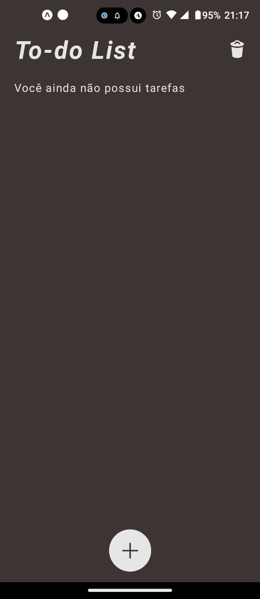
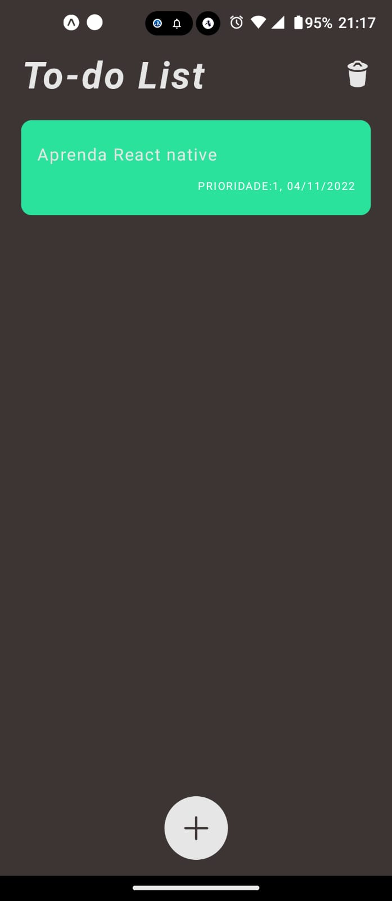
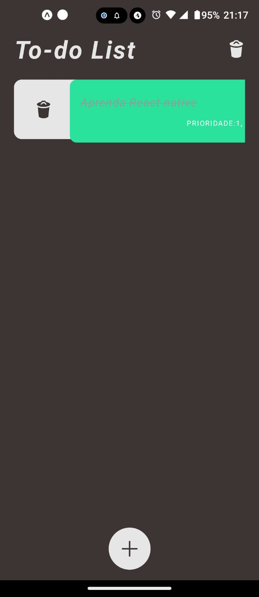
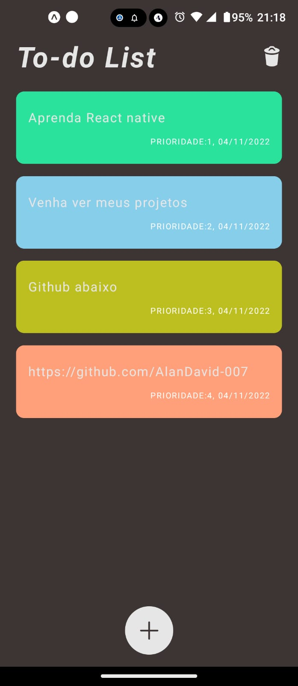

# To do list App

* The "To Do List" project was developed using React Native in conjunction with AsyncStorage.
* The primary goal of this application was to create a functional and practical to-do list.
* The application offers an initial screen where tasks are displayed, allowing actions such as adding, deleting one or all tasks, and editing the details of each one.
* Additionally, the app includes a details screen for each task, and the information is saved and retrieved using AsyncStorage.

* The "To Do List" provides users with an effective way to manage their daily tasks, keeping everything organized and accessible directly from their mobile devices.

## Table of contents

- [Overview](#overview)
  - [Built with](#built-with)
  - [Screenshot](#Screenshot)
- [Author](#author)

## Overview
* Functional To-Do List App: The project resulted in a fully functional to-do list app, where users can easily add, edit, delete, or view details of their tasks.

* Integration with AsyncStorage: The use of AsyncStorage allowed for efficient data saving and retrieval, ensuring that task information is preserved even after the app is closed.

* Task Management Convenience: The app provides a convenient way to manage and organize daily tasks, making planning and task execution more efficient.

* Intuitive Interface: The app's interface was designed with usability in mind, making it simple and easy for users to interact with their tasks.

* Development Experience: In addition to creating a useful tool for users, the project provided me with valuable development experience in the context of React Native and data persistence.

### Built with

- HTML5
- REACT NATIVE
- CSS3
- JS and JSX
- Async Storage

## Author

- Github - [#MyProfile](https://github.com/AlanDavid-007/To-do-list/)

### Screenshot

